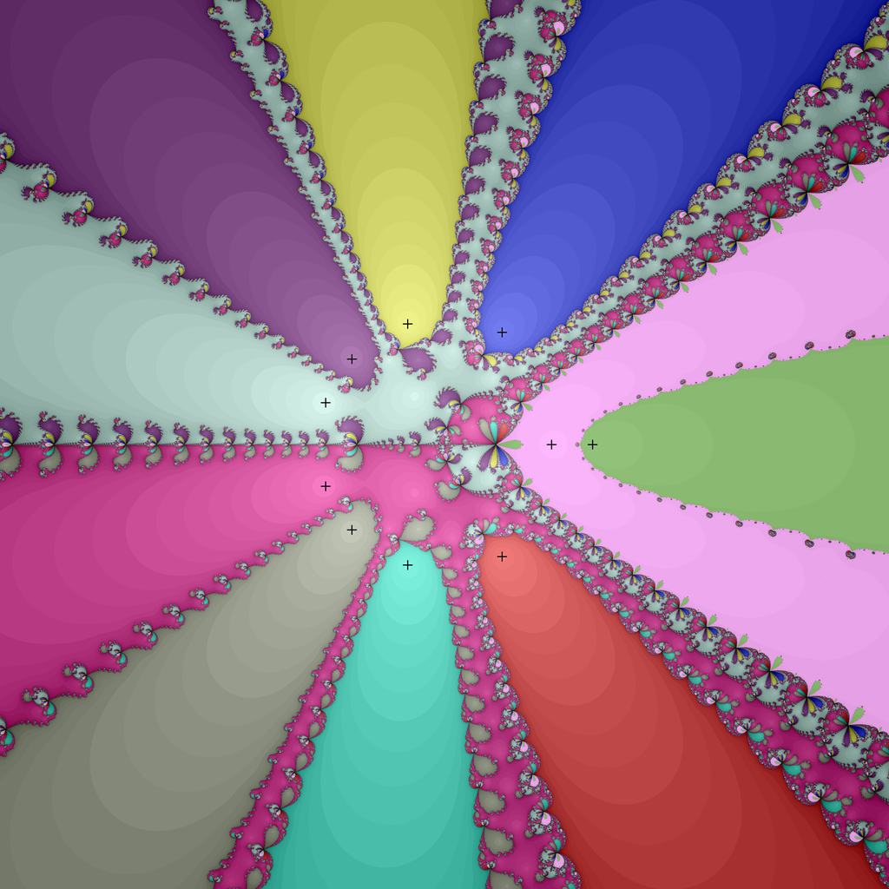
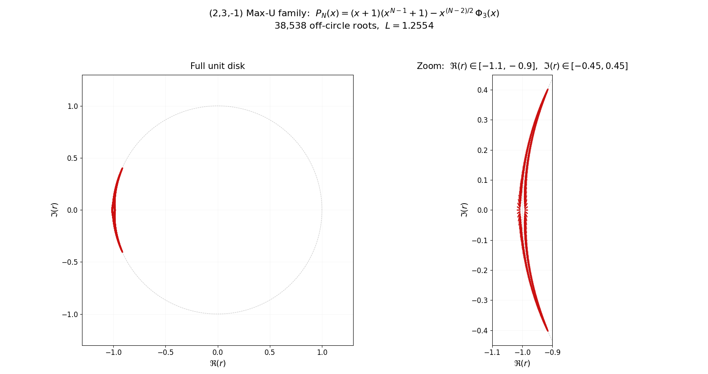
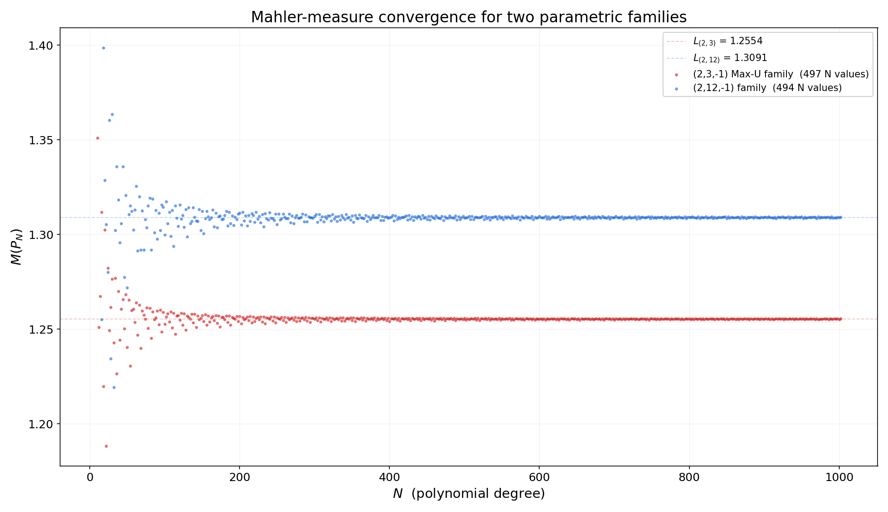
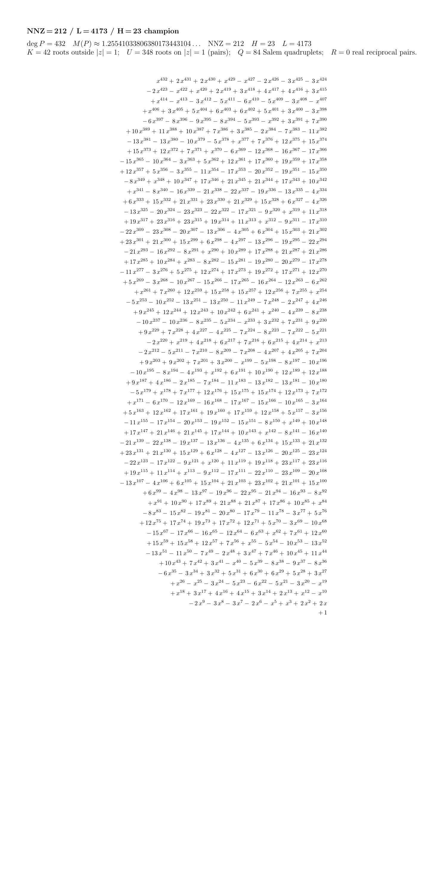
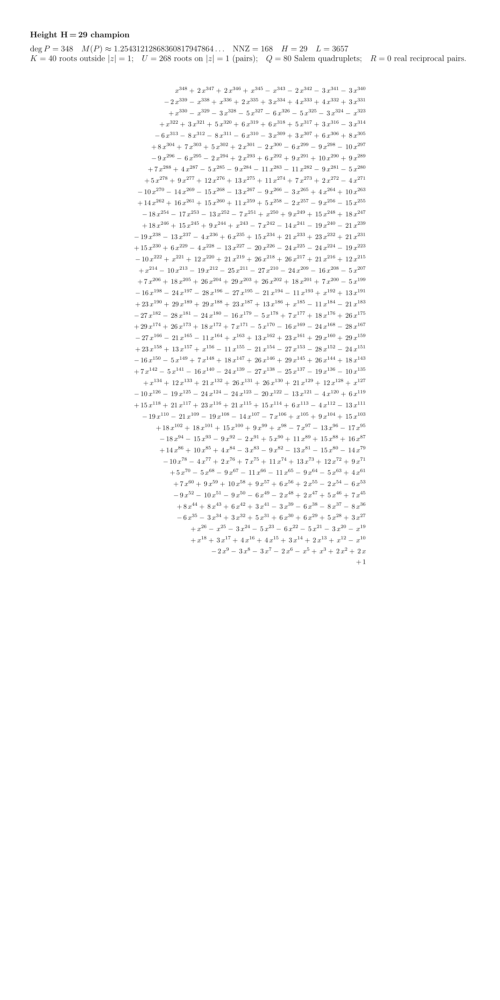
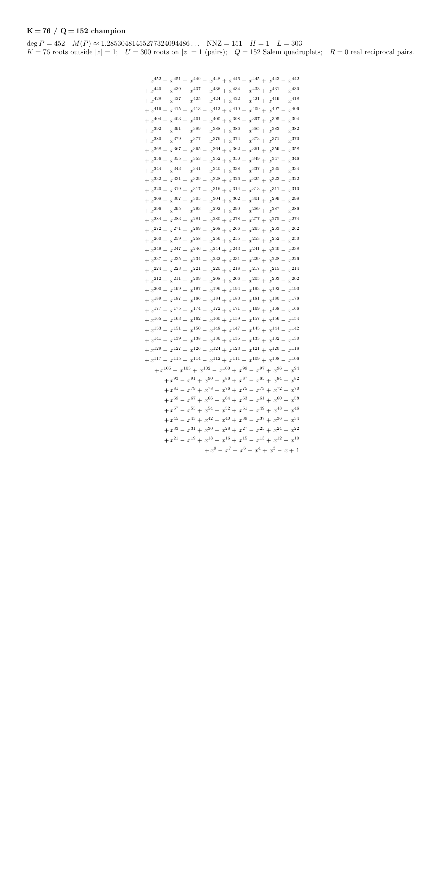

[](https://www.gnu.org/licenses/gpl-3.0)

# PSMM — Polynomials with Small Mahler Measure

Exhaustive search for primitive, irreducible, reciprocal integer polynomials
whose [Mahler measure](https://en.wikipedia.org/wiki/Mahler_measure) is below
a given threshold (typically M(p) < 1.3). The smallest known Mahler measure
greater than 1 is **Lehmer's number**, achieved by a degree-10 polynomial
discovered by D. H. Lehmer in 1933:

$$P(x) = x^{10} + x^9 - x^7 - x^6 - x^5 - x^4 - x^3 + x + 1, \qquad M(P) \approx 1.17628081825991750654\ldots$$

Whether any smaller value $M(P) > 1$ exists is **Lehmer's problem** —
one of the oldest open questions in number theory.

<table>
  <tr>
    <td align="center">
      <a href="images/lehmer.png">
        
      </a>
      <br/>
      <sub><b>Newton convergence basins</b> for Lehmer's polynomial.<br/>
      The 10 roots are marked with black crosses; each colored region is the<br/>
      basin of attraction of one root under Newton's iteration.</sub>
    </td>
    <td align="center">
      <a href="images/lehmer_0.25.png">
        
      </a>
      <br/>
      <sub><b>Zoom-in</b> on a 0.25&times;0.25 region of the basin boundary,<br/>
      revealing the fractal self-similar structure.<br/>
      Click any image for the full 4096&times;4096 version.</sub>
    </td>
  </tr>
</table>

## Contents

**Findings & results**

- [Definitions](#definitions)
- [Record holders](#record-holders)
- [The Max-U family — sparsest polynomials with most roots on |z|=1](#the-max-u-family--sparsest-polynomials-with-most-roots-on-z1)
- [Generalising to two cyclotomic parameters](#generalising-to-two-cyclotomic-parameters)
- [Densest extremal polynomials](#densest-extremal-polynomials)
- [Closest Mahler-measure pair](#closest-mahler-measure-pair)
- [Database-wide verification](#database-wide-verification)

**Practical guide**

- [How it works](#how-it-works)
- [Building](#building)
- [Usage](#usage)
- [Data files](#data-files)
- [References](#references)
- [License & citation](#license--citation)

## Results

The classical reference for polynomials with $M(P) < 1.3$ is
Mossinghoff's [`Known180`](Known180) list — 8,438 polynomials, all with
degree ≤ 180.

Our exhaustive search program found **40,262 new polynomials**: 96 at
degree ≤ 180 that Known180 missed, and 40,166 at degrees > 180. Sorted
by Mahler measure, **88% of the top 10,000 polynomials are new finds
from our search**.

Overall, the new [`AllKnownAdvanpix`](AllKnownAdvanpix) database
contains all **48,759 primitive irreducible reciprocal polynomials**
known with $M(P) < 1.3$. Of these, 48,341 came from exhaustive PSMM
search up to degree 456; the remaining 418 were derived analytically
from the
[Max-U family](#the-max-u-family--sparsest-polynomials-with-most-roots-on-z1)
and extend the database to degree 1292.

Each entry records the Mahler measure with 72-digit precision and
includes the structural counts $\mathrm{NNZ}, H, L, K, U, Q, R$.
Known180 stores only 13 digits of the Mahler measure. At higher degrees
this causes collisions — distinct polynomials whose Mahler measures
match in the first 10 or 11 digits appear identical in Known180. See
[`psmm.cpp`](psmm.cpp#L33-L86) for examples.

### Definitions

For a reciprocal polynomial
$P(x) = a_N x^N + a_{N-1} x^{N-1} + \cdots + a_1 x + a_0$
with $a_k = a_{N-k}$ (so $a_0 = a_N = 1$):

| Symbol | Definition |
|---|---|
| $\deg P = N$ | Polynomial degree (even). |
| $M(P) = \|a_N\| \cdot \prod_{\|z_i\|>1} \|z_i\|$ | **Mahler measure** — product of $\|a_N\|$ and root magnitudes outside the unit disk. |
| $\mathrm{NNZ}$ | Number of non-zero coefficients among $a_1, \ldots, a_{N/2}$ (i.e. the **half-coefficients**, excluding the fixed $a_0 = 1$). |
| $H(P) = \max_k \|a_k\|$ | **Height** — maximum coefficient magnitude (over the full polynomial). |
| $L(P) = \sum_k \|a_k\|$ | **Length** — sum of coefficient magnitudes (over the full polynomial). |
| $K$ | Count of (individual) roots strictly outside the unit disk ($\|z\| > 1$). |
| $U$ | Count of roots on the unit circle. They come in complex-conjugate pairs $\\{z, \bar z\\}$, so $U$ is even. |
| $Q$ | Count of complex non-unity roots ($\|z\| \neq 1$, $\mathrm{Im}(z) \neq 0$). They come in Salem quadruplets $\\{z, \bar z, 1/z, 1/\bar z\\}$, so $Q$ is a multiple of 4. |
| $R$ | Count of real non-unity roots ($\mathrm{Im}(z) = 0$, $\|z\| \neq 1$). They come in reciprocal pairs $\\{z, 1/z\\}$, so $R$ is even. |

For a reciprocal polynomial the roots satisfy $z \leftrightarrow 1/z$, so the
number of roots inside the unit disk equals the number outside.
This gives two useful identities:

$$2K + U = N, \qquad Q + R = 2K.$$

Storage in `AllKnownAdvanpix` is by half-coefficients $(a_0, a_1, \ldots, a_{N/2})$;
the full polynomial is recovered by reciprocity $a_k = a_{N-k}$.

### Record holders

| Record | Value | Origin | Degree | M(P) | NNZ | H | L | K | U | Q | R |
|---|---:|:---:|---:|---|---:|---:|---:|---:|---:|---:|---:|
| Smallest M (Lehmer) | M &asymp; 1.17628 | Known180 | 10 | 1.17628… | 4 | 1 | 9 | 1 | 8 | 0 | 2 |
| Most real non-unity | R = 4 | Known180 | 20 | 1.25363… | 8 | 1 | 17 | 2 | 16 | 0 | 4 |
| Largest height | H = 29 | **New** | 348 | 1.25431… | 168 | 29 | 3657 | 40 | 268 | 80 | 0 |
| Most non-zero coeffs | NNZ = 212 | **New** | 432 | 1.25541… | 212 | 23 | 4173 | 42 | 348 | 84 | 0 |
| Largest length | L = 4173 | **New** | 432 | 1.25541… | 212 | 23 | 4173 | 42 | 348 | 84 | 0 |
| Most roots outside &#124;z&#124;=1 | K = 76 | **New** | 452 | 1.28530… | 151 | 1 | 303 | 76 | 300 | 152 | 0 |
| Most complex non-unity | Q = 152 | **New** | 452 | 1.28530… | 151 | 1 | 303 | 76 | 300 | 152 | 0 |

Five of the seven category records are new discoveries — they live at
degrees 348, 432, and 452, well above the 180-degree boundary of the
prior literature. The two records inside the classical regime (Lehmer's
M-record at degree 10, and the R-record at degree 20) are pre-existing
historical entries included for completeness.

There is no entry for "most roots on $|z|=1$" because that record is held
by an *infinite parametric family*, not a single polynomial — see
[The Max-U family](#the-max-u-family--sparsest-polynomials-with-most-roots-on-z1)
below.

### The Max-U family — sparsest polynomials with most roots on $|z|=1$

Among the polynomials in our database, an unusual class stands out: **very
sparse five-term reciprocals where almost all roots sit on the unit
circle**. They follow a single template, parameterised by even degree $N$:

$$P_N(x) = (x+1)(x^{N-1}+1) - x^{N/2-1}\Phi_3(x), \qquad \Phi_3(x) = x^2+x+1, \quad N \text{ even}, \quad N \geq 6.$$

Four illustrative members:

| $N$ | $P_N(x)$ | $M(P_N)$ |
|---:|---|---|
| 6 | $x^6 + x^5 - x^4 - x^3 - x^2 + x + 1$ | $1.55603\ldots$ |
| 22 | $x^{22} + x^{21} - x^{12} - x^{11} - x^{10} + x + 1$ | $1.18837\ldots$ |
| 456 | $x^{456} + x^{455} - x^{229} - x^{228} - x^{227} + x + 1$ | $1.25491\ldots$ |
| 1002 | $x^{1002} + x^{1001} - x^{502} - x^{501} - x^{500} + x + 1$ | $1.25553\ldots$ |

The $N=22$ member is special: $P_{22}$ factors as $\Phi_{12}(x) \cdot R_{18}(x)$,
where $R_{18}$ is the **second-smallest known Salem polynomial**
($M \approx 1.18837$, just above Lehmer's $1.17628$). It is the entry
`18 1.188368…` already present in `AllKnownAdvanpix`.

The $N=456$ member is the polynomial PSMM's brute-force search originally
surfaced — three non-zero half-coefficients and yet $U=396$ roots on the
unit circle. Inspecting its structure revealed the template above; we then
computed every $P_N$ for even $N \in [6, 1002]$ and merged the new finds
back into the database.

**Structural decomposition.** Each $P_N$ is the cyclotomic product
$(x+1)(x^{N-1}+1)$ perturbed by a single sparse $\Phi_3$ term. The first
factor is a product of cyclotomic polynomials — all $N$ of its roots sit
on the unit circle. The single perturbation $-x^{N/2-1}\Phi_3(x)$, placed
at the half-degree, pushes a small number of roots off the circle into
Salem quadruplets (and occasionally one real reciprocal pair), leaving
the rest on $|z|=1$.

**Empirical scaling.** Across all $N \in [6, 1002]$ we computed, the
count of off-circle roots scales linearly with $N$ at a remarkably constant
rate:

$$\frac{K}{N} \approx 0.067 \approx \frac{1}{15}, \qquad \frac{U}{N} \approx \frac{13}{15}.$$

So roughly **13 of every 15 roots sit on the unit circle**, irrespective
of $N$. The $N=1002$ member realises $U=868$ — the largest $U$ in the
database, but the family extends to arbitrary $N$ and $U \to \infty$.

[](images/maxu-zoom-hires.png)

Off-circle roots of every $P_N$ in the family at $N \in [458, 1174]$,
filtered to drop roots within $10^{-3.3}$ of $|r|=1$. The left panel
shows the full unit disk — the entire perturbation locus is the small
red sliver near $r = -1$. The right panel zooms in on that pocket to
reveal a thin lens of complex Salem roots flanking a tight spine of
real-axis roots. (Click for higher resolution.)

#### Analytic limit (Boyd–Lawton theorem)

The convergence of $M(P_N)$ as $N \to \infty$ is **not coincidental**.
The family is a univariate monomial substitution into the bivariate
polynomial

$$F(x, u) = x(x+1) u^2 - \Phi_3(x) u + (x+1),$$

obtained by setting $u = x^{N/2-1}$ so that $x^{N-1} = x \cdot u^2$. By
the **Boyd–Lawton theorem** (Boyd 1981, Lawton 1983), the Mahler measure
of the univariate family converges to the (logarithmic) Mahler measure of
the bivariate polynomial:

$$\lim_{N \to \infty} M(P_N) = \exp\bigl(m(F)\bigr), \qquad m(F) = \frac{1}{(2\pi)^2}\!\int_0^{2\pi}\!\!\int_0^{2\pi} \log\bigl|F(e^{i\theta_1}, e^{i\theta_2})\bigr| d\theta_1 d\theta_2.$$

Numerical evaluation (via the Jensen-lemma reduction to a 1D integral —
see [`tools/compute_boyd_lawton.py`](tools/compute_boyd_lawton.py))
gives

$$m(F) \approx 0.22748124\ldots,$$

$$\boxed{\lim_{N\to\infty} M(P_N) = \exp\bigl(m(F)\bigr) \approx 1.2554340\ldots}$$

This value is corroborated by the empirical mean of $M(P_N)$ over all
even $N \in [500, 1002]$ in our scan: $\overline{M(P_N)} = 1.2554338$
(252 samples, $\sigma = 2.2 \times 10^{-4}$), agreeing with the
analytic limit to seven decimal places. The residual at $N = 1002$ is
$M(P_{1002}) - L \approx +9.5 \times 10^{-5}$.

The Boyd–Lawton limit is **above Lehmer's number** ($1.17628\ldots$),
so it is a *barrier* for this family: no matter how large $N$ grows,
$M(P_N)$ stays $\geq 1.2554\ldots$ in the limit, with the $N=22$ member
at $1.18837$ being the closest single case to Lehmer's bound that the
family achieves.



Each family $(a, d)$ has its own Boyd-Lawton limit $L_{a,d}$. The red
trace shows the Max-U family $(2, 3, -)$ above, settling onto
$L_{(2,3)} = 1.2554$; the blue trace shows the next-closest non-diagonal
family $(2, 12, -)$ from the generalisation below, settling onto
$L_{(2,12)} = 1.3091$. Reproduce with
[`tools/scan_pn_convergence.py`](tools/scan_pn_convergence.py) per
family and overlay via
[`tools/plot_two_family_convergence.py`](tools/plot_two_family_convergence.py).

### Generalising to two cyclotomic parameters

Replacing the background factor $(x+1) = \Phi_2$ by a general cyclotomic
$\Phi_a$ gives a two-parameter family:

$$P_{a,d,k,s}(x) = \Phi_a(x)(x^k+1) + s \cdot x^{(\phi(a)+k-\phi(d))/2}\Phi_d(x), \qquad \deg P_{a,d,k,s} = \phi(a) + k.$$

(Here $k$ is a perturbation index, not the polynomial degree — different
$(a, d, k, s)$ choices yield polynomials of different degrees.)

**Boyd–Lawton limit per family.** For each $(a, d)$ with
$\phi(d) \geq \phi(a)$, the sequence $M(P_{a,d,k,s})$ as $k \to \infty$
converges to $L_{a,d} = \exp(m(F_{a,d}))$ where
$F_{a,d}(x, u) = \Phi_a(x) x^{\phi(d) - \phi(a)} u^2 + s \Phi_d(x) u + \Phi_a(x)$
is the bivariate companion. The sign $s$ does not affect the limit
(substitution $u \to -u$ leaves the Mahler measure invariant).
Computed via the 1D Jensen reduction in
[`tools/compute_boyd_lawton_family.py`](tools/compute_boyd_lawton_family.py).

**M(P) limits L for each (a, d) family.** Rows: $a$. Columns: $d$.
Blank cells: $\phi(d) < \phi(a)$ (excluded by the construction).
Diagonal $a = d$: the polynomial factors into cyclotomics, so the
limit is trivially $L = 1$. The only off-diagonal cell with $L < 1.3$
is **(2, 3)** (bold) — the Max-U family.

| $a$ \ $d$ | 2 | 3 | 4 | 5 | 6 | 7 | 8 | 9 | 10 | 11 | 12 | 13 | 14 | 15 |
|---:|:-:|:-:|:-:|:-:|:-:|:-:|:-:|:-:|:-:|:-:|:-:|:-:|:-:|:-:|
| **2**  | 1 | **1.2554** | 1.5351 | 1.3321 | 1.8531 | 1.3883 | 1.4098 | 1.4497 | 1.9725 | 1.3748 | 1.3091 | 1.3820 | 1.9242 | 1.9283 |
| **3**  |   | 1 | 1.4751 | 1.3157 | 2.0622 | 1.3500 | 1.3824 | 1.8067 | 1.9558 | 1.3875 | 1.7404 | 1.3794 | 1.9901 | 2.2096 |
| **4**  |   | 1.3405 | 1 | 1.4227 | 1.3405 | 1.5326 | 1.5351 | 1.4802 | 1.4227 | 1.4974 | 1.8531 | 1.5165 | 1.5326 | 1.8801 |
| **5**  |   |   |   | 1 |   | 1.3602 | 1.4819 | 1.5759 | 2.1497 | 1.3647 | 1.6402 | 1.3814 | 1.8807 | 2.3270 |
| **6**  |   | 2.0622 | 1.4751 | 1.9558 | 1 | 1.9901 | 1.3824 | 1.3946 | 1.3157 | 1.9653 | 1.7404 | 2.0081 | 1.3500 | 1.5028 |
| **7**  |   |   |   |   |   | 1 |   | 1.6713 |   | 1.3689 |   | 1.3645 | 2.1641 | 2.0863 |
| **8**  |   |   |   | 1.6126 |   | 1.6456 | 1 | 1.4299 | 1.6126 | 1.6226 | 1.3405 | 1.6133 | 1.6456 | 1.7124 |
| **9**  |   |   |   |   |   | 1.6247 |   | 1 |   | 1.6326 |   | 1.6319 | 1.7228 | 1.5772 |
| **10** |   |   |   | 2.1497 |   | 1.8807 | 1.4819 | 1.7032 | 1 | 2.0166 | 1.6402 | 1.9378 | 1.3602 | 1.5156 |
| **11** |   |   |   |   |   |   |   |   |   | 1 |   | 1.3776 |   |   |
| **12** |   |   |   | 1.7823 |   | 1.7896 | 1.4751 | 1.5738 | 1.7823 | 1.8552 | 1 | 1.9043 | 1.7896 | 1.6709 |
| **13** |   |   |   |   |   |   |   |   |   |   |   | 1 |   |   |
| **14** |   |   |   |   |   | 2.1641 |   | 1.6421 |   | 1.9256 |   | 2.0258 | 1 | 1.6993 |
| **15** |   |   |   |   |   |   |   |   |   | 2.1573 |   | 2.1829 |   | 1 |

Among all 100 non-diagonal cells, only **(2, 3)** has $L < 1.3$. That
family is the Max-U one analysed in detail above; entries at large $k$
of both signs are merged into `AllKnownAdvanpix`. Every other family
converges to a limit above the database's $M < 1.3$ coverage threshold
and cannot contribute new sub-1.3 entries at large $k$.

We swept $a \in \{2, 3, 4, 6\}$, $d \in \{3, 5, 7, 8, 9, 10, 12\}$,
$s \in \{-1, +1\}$, $k \in [5, 201]$ — factored each $P_{a,d,k,s}$ over
$\mathbb{Z}$, and recorded the Mahler measure of the smallest non-cyclotomic
irreducible factor.

**Result.** Across the entire sweep, the global minimum is
**$M = 1.17628\ldots$**, i.e. Lehmer's number itself. **Four** distinct
parameter combinations all factor to include Lehmer's polynomial (or its
$x \to -x$ reflection, which has the same Mahler measure):

| $a$ | $d$ | $k$ | sign | smallest non-cyc factor |
|---:|---:|---:|:---:|---|
|  2  |  3  | 23  |  +  | Lehmer's polynomial (degree 10) |
|  2  |  5  |  9  |  −  | Lehmer's polynomial |
|  2  |  7  | 15  |  −  | Lehmer's polynomial |
|  3  |  7  |  8  |  −  | Lehmer's polynomial |

The second-smallest in the sweep is $M \approx 1.18837$ at
$(a, d, k, s) = (2, 3, 21, -)$ — the Lehmer sibling we found earlier.

**The cyclotomic-perturbation family cannot break Lehmer's bound, but it
embeds Lehmer's polynomial naturally in many ways.** This is consistent
with Boyd's conjecture that all small Mahler measures $> 1$ arise from a
structured (Salem–Boyd-style) construction.

Reproduce with [`tools/sweep_ad.py`](tools/sweep_ad.py); raw data in
[`doc/ad_sweep.csv`](doc/ad_sweep.csv).

### Densest extremal polynomials

The polynomials maximising height ($H$), length ($L$), non-zero count
($\mathrm{NNZ}$), and root count outside the unit disk ($K$) all live near
degrees 350–452 and have hundreds of non-zero coefficients with intricate
combinatorial structure. Click any thumbnail below for the full polynomial
typeset in LaTeX:

<table>
  <tr>
    <td align="center" width="33%">
      <a href="images/champion_nnz212.png">
        
      </a>
      <br/>
      <sub><b>NNZ = 212 / L = 4173 / H = 23</b><br/>
      degree 432, M &asymp; 1.25541<br/>
      212 non-zero half-coefficients,<br/>
      height 23, length 4173</sub>
    </td>
    <td align="center" width="33%">
      <a href="images/champion_h29.png">
        
      </a>
      <br/>
      <sub><b>H = 29</b><br/>
      degree 348, M &asymp; 1.25431<br/>
      168 non-zero half-coefficients,<br/>
      max single coefficient 29</sub>
    </td>
    <td align="center" width="33%">
      <a href="images/champion_k76.png">
        
      </a>
      <br/>
      <sub><b>K = 76 / Q = 152</b><br/>
      degree 452, M &asymp; 1.28530<br/>
      striking periodic (1, &minus;1, 0)<br/>
      coefficient signature</sub>
    </td>
  </tr>
</table>

### Closest Mahler-measure pair

A natural question for any large set of algebraic numbers is *how close
together can two of them be?* Scanning all 48,759 entries in
`AllKnownAdvanpix`, the two polynomials whose Mahler measures differ by
the **smallest amount** are:

| Degree | $P(x)$ | $M(P)$ |
|---:|---|---|
| 378 | $x^{378} - x^{337} - x^{189} - x^{41} + 1$ | $\mathbf{1.286155162556}219358714851308069\ldots$ |
| 358 | $x^{358} + x^{297} - x^{179} + x^{61} + 1$ | $\mathbf{1.286155162556}991265787643695188\ldots$ |

$$|M_1 - M_2| \approx 7.72 \times 10^{-13}.$$

The two Mahler measures agree to **12 decimal places**, then diverge. The
two polynomials themselves are structurally unrelated: they sit at
different degrees, have different coefficient supports, and live in the
upper end of the database's $M < 1.3$ coverage (well above Lehmer's number).
Both happen to be among the sparsest five-term reciprocals in the database
($\mathrm{NNZ} = 2$, $L = 5$), with the perturbations placed at the
half-degree and at one off-centre position — but the off-centre placements
differ ($41$ vs $61$) and so do the signs.

**This record is a finite-truncation artifact, not a structural bound.**
For any convergent family $\\{P_N\\}$ with $M(P_N) \to L$, the Cauchy
property says: for any $\varepsilon > 0$ there exist $N_1, N_2$ with
$|M(P_{N_1}) - M(P_{N_2})| < \varepsilon$. Pick $N_1, N_2$ large enough
that each $M(P_{N_i})$ is within $\varepsilon/2$ of $L$. The
[Max-U family](#the-max-u-family--sparsest-polynomials-with-most-roots-on-z1)
above is exactly such a family: $M(P_N) \to 1.2554340\ldots$ Empirically
$|M(P_N) - L| = O(1/N)$ and the consecutive gap $|M(P_N) - M(P_{N+2})|$
shrinks like $O(1/N^2)$. Extending the family far enough beyond
$N = 1002$ would eventually undercut the $7.72 \times 10^{-13}$ pair
above with a pair drawn entirely from a single family.

Reproduce with `./build/psmm -analyze=AllKnownAdvanpix` (look for the line
"Polynomials with nearest Mahler measures").

### Database-wide verification

Every one of the **48,759 polynomials** in `AllKnownAdvanpix` has been
re-verified independently with [PARI/GP](https://pari.math.u-bordeaux.fr/):
irreducibility over $\mathbb{Z}$, Mahler measure agreement with the
stored 72-digit value, and self-consistent root counts $(K, U, Q, R)$
satisfying the reciprocity identity $2K + U = N$. **No discrepancies
remain.** The audit and the cross-checking script
([`tools/bulk_verify.py`](tools/bulk_verify.py)) are reproducible end-to-end;
per-entry results are recorded in
[`doc/database-verification.csv`](doc/database-verification.csv).

## How it works

### Search space

A monic reciprocal polynomial of even degree $N$ has the form

$$P(x) = x^N + a_1 x^{N-1} + a_2 x^{N-2} + \cdots + a_2 x^2 + a_1 x + 1, \qquad a_k = a_{N-k},$$

so the polynomial is fully determined by the $N/2$ free **half-coefficients**
$a_1, a_2, \ldots, a_{N/2}$ (the leading and constant coefficient $a_0 = a_N = 1$
are fixed). PSMM enumerates all such polynomials with:

- **integer coefficients** drawn from a user-supplied alphabet
  $\mathcal{A} = \\{c_0, c_1, \ldots, c_{b-1}\\}$ (e.g. $\\{-1, 1\\}$, $b = 2$);
- exactly **$k$ non-zero half-coefficients** (sparsity constraint).

#### The bijection that makes everything fast

The two constraints — *which* of the $N/2$ positions are non-zero, and
*what* values they take — decouple cleanly. Pick the **sparsity pattern**
(a subset of size $k$ chosen from $\\{1, 2, \ldots, N/2\\}$), then assign
each chosen position a value from $\mathcal{A}$. The total count is

$$Q(N, k, b) = \binom{N/2}{k} \cdot b^{k}.$$

The enumeration is implemented as a **bijection** between
$\\{0, 1, \ldots, Q(N,k,b) - 1\\}$ and the candidate polynomial set:

- The pattern index runs through all $\binom{N/2}{k}$ subsets via
  `std::next_permutation`.
- The value-assignment index is a **mixed-radix counter** with base $b$ and
  $k$ digits — literally `m_Number[k-1] m_Number[k-2] ... m_Number[0]` in
  the iterator, incremented by add-with-carry.

So the entire search space is, structurally, a single integer counter from
$0$ to $Q - 1$. Three consequences:

1. **Resumability**: a search can be paused and resumed by recording the
   counter value.
2. **Parallelism**: any contiguous interval $[i, j)$ of the counter is an
   independent sub-search — workers can be handed disjoint intervals with no
   coordination beyond merging results at the end. PSMM uses this internally
   (batches of 256 polynomials feed a thread pool, see [`psmm.cpp`](psmm.cpp)),
   and externally for cluster-scale searches (split the counter by degree or
   by nnz across machines, then `-merge` the result files).
3. **Symmetry pruning**: polynomials related by the substitution $x \mapsto -x$
   (which preserves Mahler measure) are detected from the pattern alone and
   skipped, halving the effective work for symmetric alphabets like $\\{-1, 1\\}$.

#### Scale considerations

| Degree $N$ | nnz $k$ | $\mathcal{A}$ | $Q(N,k,b)$ |
|---:|---:|---|---:|
| 100 | 3 | $\{-1,1\}$ | $\binom{50}{3} \cdot 2^3 \approx 1.6 \times 10^5$ |
| 200 | 3 | $\{-1,1\}$ | $\binom{100}{3} \cdot 2^3 \approx 1.3 \times 10^6$ |
| 400 | 3 | $\{-1,1\}$ | $\binom{200}{3} \cdot 2^3 \approx 1.0 \times 10^7$ |
| 200 | 4 | $\{-1,1\}$ | $\binom{100}{4} \cdot 2^4 \approx 6.3 \times 10^7$ |
| 200 | 5 | $\{-1,1\}$ | $\binom{100}{5} \cdot 2^5 \approx 2.4 \times 10^9$ |
| 100 | 5 | $\{-1,0,1\}$ | $\binom{50}{5} \cdot 3^5 \approx 5.1 \times 10^8$ |

Exhaustive search is comfortable at low nnz with a binary alphabet up to
degree several hundred, but grows quickly with both. Most production runs
fix $\mathcal{A} = \{-1, 1\}$ and sweep over $k \in \{1, 2, 3, 4\}$.

### Mahler measure computation

For each candidate polynomial, the Mahler measure is computed by finding
all roots using [MPSolve](https://github.com/robol/MPSolve) (Aberth
method, arbitrary precision) and taking the product of the absolute values
of roots outside the unit circle:

    M(p) = |a_N| * prod_{|z_i| > 1} |z_i|

Two modes are available:

- **Fast estimator** (`USE_FAST_MAHLER_ESTIMATOR`, default ON): a patched
  MPSolve that aborts root-finding early as soon as any root's inclusion
  disk lies entirely outside |z| = threshold. Returns immediately with
  "over threshold" for polynomials that clearly exceed the bound.
- **Full computation**: finds all roots to double precision (64-bit GMP
  limb), computes M(p) exactly.

### Deduplication and verification

Candidates with M(p) &le; threshold are checked against a list of
previously known polynomials (`-known` file) and against polynomials
found earlier in the current session. Matching is by Mahler measure
within a tolerance of 1e-14, restricted to polynomials of equal or
lower degree (a higher-degree polynomial with the same M is a multiple
of a known one).

Surviving candidates are then:

1. **Factored** over Z using [NTL](https://libntl.org/). Reducible
   polynomials are split into irreducible factors; each factor with
   M(p) &le; threshold is checked independently.
2. **Verified** by recomputing the Mahler measure in extended precision
   (72 decimal digits, ~240 bits) and cross-checking against the known
   list at that precision.

Only primitively new, irreducible polynomials with verified Mahler measure
are written to the output.

### Parallelism

The outer search loop is parallelized across `-threads` worker threads.
Each worker computes the Mahler measure for a batch of polynomials
independently (one MPSolve context per call, single-threaded internally).
Deduplication and logging run sequentially on the main thread after each
batch completes.

## Building

### Prerequisites

| Dependency | Purpose | Install (Ubuntu/Debian) |
|---|---|---|
| CMake &ge; 3.20 | Build system | `sudo apt install cmake` |
| GCC &ge; 10 or Clang &ge; 12 | C++17 compiler | `sudo apt install g++` |
| GMP + GMPXX | Arbitrary-precision arithmetic | `sudo apt install libgmp-dev` |
| NTL | Polynomial factorization over Z | `sudo apt install libntl-dev` |
| autoconf, automake, libtool | MPSolve build (autotools) | `sudo apt install autoconf automake libtool` |
| bison, flex | MPSolve parser generator | `sudo apt install bison flex` |
| pkg-config | MPSolve configure | `sudo apt install pkg-config` |
| pthreads | Threading | (included with glibc) |

One-liner for Ubuntu/Debian:

```sh
sudo apt install cmake g++ libgmp-dev libntl-dev autoconf automake libtool bison flex pkg-config
```

### Build

```sh
cmake -B build -S .
cmake --build build -j
```

MPSolve 3.2.2 is downloaded, patched, and built automatically as part of the
CMake configure step (via `ExternalProject`). No system-wide MPSolve
installation is needed.

### Run tests

```sh
cd build && ctest --output-on-failure
```

## Usage

PSMM operates in three modes: **search**, **merge**, and **analyze**.

### Search

Enumerate all reciprocal polynomials of a given degree and report those
with Mahler measure below the threshold.

```sh
./build/psmm \
    -degree=N \
    -coeffs=-1,1 \
    -nnz=1,2,3 \
    -threshold=1.3 \
    -threads=8 \
    -period=3600 \
    -known=AllKnownAdvanpix \
    -addto=AllKnownAdvanpix
```

| Argument | Description |
|---|---|
| `-degree=N` | Polynomial degree (must be even and positive). |
| `-coeffs=c0,c1,...` | Comma-separated list of allowed coefficient values. |
| `-nnz=n1,n2,...` | Comma-separated list of non-zero half-coefficient counts to search. |
| `-threshold=T` | Upper bound on Mahler measure (typically 1.3). |
| `-threads=N` | Number of parallel worker threads (default 1). |
| `-period=S` | Progress report interval in seconds (default 5). |
| `-known=FILE` | File of previously known polynomials to skip (optional). |
| `-addto=FILE` | Append verified results to this file (optional). |

**Example — continue the search from existing results:**

```sh
# Search degree 100, coefficients {-1, 1}, nnz 1-3, using 8 threads.
# Skip polynomials already in AllKnownAdvanpix; append new finds to it.
./build/psmm \
    -degree=100 \
    -coeffs=-1,1 \
    -nnz=1,2,3 \
    -threshold=1.3 \
    -threads=8 \
    -period=3600 \
    -known=AllKnownAdvanpix \
    -addto=AllKnownAdvanpix \
    > 100_psmm.txt
```

The log file (`100_psmm.txt`) contains:

- `***` lines: newly found polynomials (not in `-known`, not seen earlier in this session).
- `+++` lines: polynomials found again in this session (duplicate within the run).
- `---` lines: polynomials already in the `-known` file (with degree of the match in parentheses).
- Periodic progress lines: polynomials per second, estimated time remaining.

**Resuming from a crashed search log:**

If a search crashes mid-run (e.g. out of memory), the intermediate `***`
results can be extracted from the log and re-verified:

```sh
./build/psmm \
    -degree=100 \
    -coeffs=-1,1 \
    -nnz=1,2,3 \
    -threshold=1.3 \
    -threads=8 \
    -fromlog=100_psmm.txt \
    -known=AllKnownAdvanpix \
    -addto=AllKnownAdvanpix
```

### Merge

Combine multiple result files, remove duplicates, and produce a single
sorted output. To fold new search results into the master file, include
`AllKnownAdvanpix` as one of the inputs:

```sh
./build/psmm \
    -merge=AllKnownAdvanpix,results_100.txt,results_200.txt \
    -output=AllKnownAdvanpix
```

All inputs are read first, then deduplicated by extended-precision Mahler
measure and sorted by degree. The `-output` file is rewritten with the
clean union. This is the standard way to consolidate results from parallel
searches at different degrees back into a single master file.

### Analyze

Load a results file and display statistics — minimum Mahler measures,
nearest pair, extremal values of NNZ, H, L, K, U, Q, R, and any
non-primitive polynomials:

```sh
./build/psmm -analyze=AllKnownAdvanpix
```

## Data files

| File | Description |
|---|---|
| `AllKnownAdvanpix` | Extended set of known polynomials with M(p) < 1.3, including all entries from `Known180` plus ~40k new finds at degrees > 180 from this project. 72-digit Mahler measures. |
| `Known180` | Michael Mossinghoff's historical list through degree 180 ([source](http://www.cecm.sfu.ca/~mjm/Lehmer/lists/)). Legacy format with 13-digit precision. |

**File format** (AllKnownAdvanpix):

```
N M NNZ H L K U Q R c_0 c_1 ... c_{N/2}
```

| Field | Meaning |
|---|---|
| N | Polynomial degree |
| M | Mahler measure (72 decimal digits) |
| NNZ | Non-zero half-coefficients (excluding the leading 1) |
| H | Height (max coefficient magnitude) |
| L | Length (sum of coefficient magnitudes) |
| K | Roots outside the unit circle |
| U | Roots on the unit circle (complex conjugate pairs) |
| Q | Complex non-unity roots (quadruplets) |
| R | Real non-unity roots (pairs) |
| c_0 ... c_{N/2} | Half-coefficients (c_0 = 1 always) |

## References

- D. H. Lehmer, *Factorization of certain cyclotomic functions*, Ann. of Math. **34** (1933), 461--479.
- M. J. Mossinghoff, *Polynomials with small Mahler measure*, Math. Comp. **67** (1998), 1697--1715.
- R. Breusch, *On the distribution of the roots of a polynomial with integral coefficients*, Proc. Amer. Math. Soc. **2** (1951), 939--941.
- C. J. Smyth, *On the product of the conjugates outside the unit circle of an algebraic integer*, Bull. London Math. Soc. **3** (1971), 169--175.
- MPSolve: D. A. Bini and G. Fiorentino, *Design, analysis, and implementation of a multiprecision polynomial rootfinder*, Numer. Algorithms **23** (2000), 127--173.

## License & citation

This repository is dual-licensed:

- **Source code** (everything under the repository root except the items
  listed below): [GPL-3.0-or-later](LICENSE). Each source file carries
  a license header indicating this.
- **Polynomial database** (`AllKnownAdvanpix`, `Known180`, files under
  `tests/data/`) and **figures** (`images/*`): [Creative Commons
  Attribution 4.0 International (CC BY 4.0)](https://creativecommons.org/licenses/by/4.0/).
  See [LICENSE-DATA](LICENSE-DATA) for the full terms.

If you use any of these resources in published work, please cite:

> Pavel Holoborodko, *PSMM: Polynomials with Small Mahler Measure*,
> Advanpix LLC, 2020–2026. <https://github.com/advanpix/PSMM>

A machine-readable citation entry is provided in [`CITATION.cff`](CITATION.cff)
(GitHub's "Cite this repository" widget reads this file).
