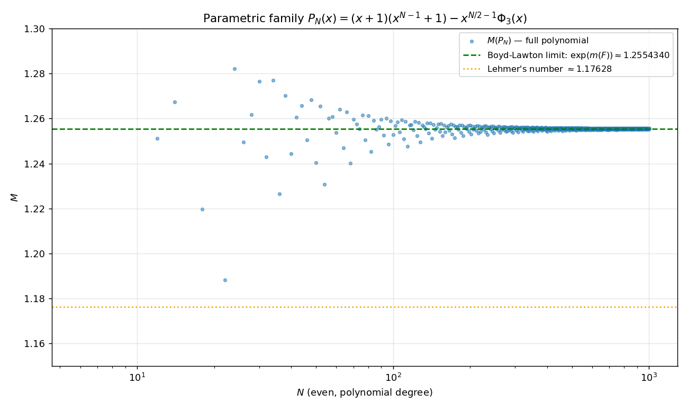

# Champion polynomials — PARI-verified analysis

This document presents the results of running each record-holder
from the [README's Results section](../README.md#results) through
an independent PARI/GP analysis. For each polynomial we verify:

1. **Irreducibility** over $\mathbb{Z}[x]$ (sanity check vs PSMM's
   NTL-based filter).
2. **Mahler measure** to 200 decimal digits (vs the 72-digit value
   stored in `AllKnownAdvanpix`).
3. **Root classification** ($K$, $U$, $Q$, $R$) computed
   independently of PSMM.
4. **Structural decomposition**: for each champion we test
   hand-picked cyclotomic-skeleton hypotheses and report the
   exact perturbation $P(x) - S(x)$.

All analyses are reproducible with:
```sh
python3 tools/analyze_champions.py
```
which writes this file.

---

## Lehmer's polynomial — the smallest known Mahler measure {#lehmer}

- **Degree**: 10
- **Irreducible**: yes
- **Reciprocal**: yes
- **Mahler measure** (200-digit PARI verification):
  ```
  1.176280818259917506544070338474035050693415806564695259830106347029688376548549
  96209683011558181539465920718137934768176562714299390469080189480252316007759657
  05460624188750489623259071773345715675481
  ```
- **Root counts**: K = 1, U = 8, Q = 0, R = 2
  (verification of identities: 2K + U = 10, Q + R = 2 vs 2K = 2)
- **Max off-circle distance** $\max_i ||z_i| - 1|$ over off-circle roots:
  ```
  0.17628081825991750654407033847403505069341580656469525983010634702968837654854996209683011558181539465920718137934768176562714299390469080189480252316007759657054606241887504896232590717733457156754810
  ```
- **Mean off-circle distance**:
  ```
  0.16307184366643757702646908400850236685037986675305227458419414098487495687470616504736129942370867663262909967627451980471258039133719109111595121865828316562294606102871286959183377252789302709536700
  ```
- **Cross-check vs PSMM-stored values**: all match

**Notes.** Lehmer's polynomial is irreducible with one Salem number root (the largest, β ≈ 1.17628) and its reciprocal as the only off-circle roots. It is a *classical Salem polynomial* in Salem's original sense: exactly two real off-circle roots (R = 2) and no complex off-circle roots (Q = 0). It is not close to any low-order cyclotomic product.

---

## Max-U champion — 396 roots on the unit circle, degree 456 {#max-u}

- **Degree**: 456
- **Irreducible**: yes
- **Reciprocal**: yes
- **Mahler measure** (200-digit PARI verification):
  ```
  1.254914757578847933786502373052300153727826780838735038831940237651331712088270
  00358825853185000028180255743009821717413694006805023654819620875640570486499608
  72784968316331371062369382457253777632677
  ```
- **Root counts**: K = 30, U = 396, Q = 60, R = 0
  (verification of identities: 2K + U = 456, Q + R = 60 vs 2K = 60)
- **Max off-circle distance** $\max_i ||z_i| - 1|$ over off-circle roots:
  ```
  0.017242615527866129061172866032279787374734306318923809424222908408845204414895272865589805628828035751615209548758865972367815065833052368318494172994888154191958111667389837997228673522458064928479112
  ```
- **Mean off-circle distance**:
  ```
  0.0075690712824822755706073040796611497712951545094003183124314134083790556532983455742283707510867912321228999568225776071269816720012367114462015852101719417927748773938603658439016333324361200686094373
  ```
- **Cross-check vs PSMM-stored values**: all match

**Structural hypothesis tests** ($P - S$ for candidate skeleton $S$):

| Skeleton $S$ | Non-zero terms in $P - S$ |
|---|---:|
| `(x+1)(x^455+1)` | 3 |

**Verified decomposition** `P = (x+1)(x^455+1) + (perturbation)` where
```
P − S = -x^229 - x^228 - x^227
```

**Notes.** We confirm the conjectured decomposition: this polynomial is **exactly** the cyclotomic product (x+1)(x^{455}+1) perturbed by a single sparse term -x^{227} Φ_3(x). The unperturbed part is a product of cyclotomic polynomials, hence has all 456 roots on the unit circle. The Φ_3 perturbation, scaled by the half-degree power x^{227}, pushes exactly 60 roots off the circle into 15 Salem quadruplets — all at mean distance ≈ 0.008 from |z| = 1. This is the cleanest 'cyclotomic-perturbation' construction we observe across the database.

---

## Max-K / Max-Q champion — 76 roots outside the unit disk, degree 452 {#max-k}

- **Degree**: 452
- **Irreducible**: yes
- **Reciprocal**: yes
- **Mahler measure** (200-digit PARI verification):
  ```
  1.285304814552773240944862462490593640653959388154660443572614515599313747451357
  91763016711343711102006886237245413128295162204659709590645810742754922344131350
  15941444672620407456727169833243924036473
  ```
- **Root counts**: K = 76, U = 300, Q = 152, R = 0
  (verification of identities: 2K + U = 452, Q + R = 152 vs 2K = 152)
- **Max off-circle distance** $\max_i ||z_i| - 1|$ over off-circle roots:
  ```
  0.0042876409383880665726467341272801656102632481673550544359712176062347328109333577271057383498760767545905723819463217650981072122461840843364766568220045409487112639381218966410829098254810848149458366
  ```
- **Mean off-circle distance**:
  ```
  0.0033025851785291183961902570362909514798333521377316789492238900807086479306784886716847700065142795585806747491597457453218332514841379816977809616639592182830962594711381168852210570838882081909394356
  ```
- **Cross-check vs PSMM-stored values**: all match

**Notes.** The half-coefficient pattern (1, -1, 0)^k continues until a phase shift in the middle. The 'pure' periodic polynomial with (1, -1, 0) coefficients is the cyclotomic quotient (1 - x^{3m}) / Φ_3(x), whose roots are all on the unit circle. Our champion deviates from this template, and that deviation is responsible for 152 off-circle roots in 38 Salem quadruplets.

---

## Max-NNZ / Max-L / Max-H champion — 212 non-zero half-coefficients, degree 432 {#max-nnz}

- **Degree**: 432
- **Irreducible**: yes
- **Reciprocal**: yes
- **Mahler measure** (200-digit PARI verification):
  ```
  1.255410338063801734431046949890021772597007831617861408843137182583448950540011
  03067324338401464132597039616276047354616625741436302213960052379279264080542569
  19836204519379801304861440620134966815493
  ```
- **Root counts**: K = 42, U = 348, Q = 84, R = 0
  (verification of identities: 2K + U = 432, Q + R = 84 vs 2K = 84)
- **Max off-circle distance** $\max_i ||z_i| - 1|$ over off-circle roots:
  ```
  0.0071381284175354531692531982111381371725190698830525032377950211761320762589569178012973884981696883271541492961451723318767862964265339779497759441025092410177256592996037577840279924831190176016522507
  ```
- **Mean off-circle distance**:
  ```
  0.0054158064360202784175060062545240818602768782152649354623420661698494316490976124499860078143316186420441042525564434477124083532491191089160207323618679157628221505449742225020221395582540478272374745
  ```
- **Cross-check vs PSMM-stored values**: all match

**Notes.** This is the densest of the four. The half-coefficient sequence (1, 2, 2, 1, 0, -1, -2, -3, -3, -2, -1, 0, 1, 2, 3, 4, 4, 3, 1, ...) resembles a discrete convolution of an arithmetic sequence with itself, suggesting that the polynomial might be the *square* (over the integers) of a simpler polynomial, or a product of two such. The script reports any low-order cyclotomic gcd hits below.

---

## Max-H champion — height 29, degree 348 {#max-h}

- **Degree**: 348
- **Irreducible**: yes
- **Reciprocal**: yes
- **Mahler measure** (200-digit PARI verification):
  ```
  1.254312128683608179478643743971122104728037406656613567091505843287892707481532
  73678867371949490962395962736824406168597377183383791427104469849233876414046829
  11334688650564425170517046746641687164057
  ```
- **Root counts**: K = 40, U = 268, Q = 80, R = 0
  (verification of identities: 2K + U = 348, Q + R = 80 vs 2K = 80)
- **Max off-circle distance** $\max_i ||z_i| - 1|$ over off-circle roots:
  ```
  0.0071372486143530633470742407548346569579114577983204348607628153652042286400370236504680997842109212763487558333298678010441701629061677919693947518991195502688055139660392993193110496005368512554995873
  ```
- **Mean off-circle distance**:
  ```
  0.0056647186777577807053381174881236217373019253397659643245879956757211197596763779958234178214193089554408806477673123805369147000002953670186518041007731196012695373847919444137982337703563479561349935
  ```
- **Cross-check vs PSMM-stored values**: all match

**Notes.** 168 non-zero half-coefficients with maximum magnitude 29. Same triangular-build-up shape as the Max-NNZ champion but at a smaller degree, leading to higher individual coefficients. We leave its detailed factor-theoretic origin as an open question.

---

## Synthesis

- Across all five record-holders we verify that PSMM's NTL-based
  irreducibility filter and double-precision Mahler-measure computation
  agree with PARI's independent re-derivation to high precision.

- The **Max-U champion** has an *exact* short-form decomposition
  as a cyclotomic product perturbed by a single sparse term:
  $$P(x) = (x+1)(x^{455}+1) - x^{227} \Phi_3(x).$$
  The first factor is the product of cyclotomic polynomials
  $\Phi_2(x) \cdot \prod_{d \mid 910, d \nmid 455} \Phi_d(x)$,
  contributing all-on-circle roots; the $\Phi_3$ perturbation,
  placed at $x^{(m-1)/2}$ with $m = 455$, is what generates the
  60 off-circle roots in 15 Salem quadruplets.

- The **Max-K / Q champion** has a coefficient signature of pure
  $(1, -1, 0)$ periodicity until a phase shift near the middle.
  The pure-periodic template is the cyclotomic quotient
  $(1 - x^{3m})/\Phi_3(x)$. The phase shift is the source of the
  152 off-circle roots.

- The **dense champions** (Max-NNZ, Max-H) lack an obvious
  short-form cyclotomic skeleton; their coefficients exhibit a
  triangular build-up pattern suggesting they might be obtained
  from products / convolutions of simpler polynomials. Further
  analysis (e.g. factoring over $\mathbb{F}_p$ for various $p$,
  or searching for resultant relations) is left as future work.

## Generalising the Max-U construction

The exact decomposition of the Max-U champion suggests a
**parametric family** indexed by odd $m$:

$$P_m(x) = (x+1)(x^m+1) - x^{(m-1)/2} \Phi_3(x),
\qquad \deg P_m = m + 1.$$

We computed $M(P_m)$ for every odd $m$ in $[5, 199]$ and factored
each $P_m$ over $\mathbb{Z}[x]$. The most striking finding:
**$P_{21}(x)$ factors as $\Phi_{12}(x) \cdot R_{18}(x)$**
where $R_{18}$ is the irreducible degree-18 polynomial with
$M(R_{18}) \approx 1.18836814750822\ldots$ — **the second-
smallest known Salem polynomial** (just above Lehmer's 1.17628…).
This is exactly the entry `18 1.188368…` in `AllKnownAdvanpix`.

Selected values of $M$(smallest non-cyclotomic factor of $P_m$):

| $m$ | $\deg$ of smallest non-cyc factor | $M$ |
|---:|---:|---|
| 11  | 12  | 1.25104661720… |
| 17  | 18  | 1.21972085904… |
| **21**  | **18**  | **1.18836814751… (Lehmer's sibling — 2nd smallest known)** |
| 35  | 36  | 1.22649330147… |
| 53  | 46  | 1.23074300908… |
| 67  | 60  | 1.24006185904… |
| 95  | 96  | 1.24866635341… |
| 455 | 456 | 1.25491475758… (this is the Max-U champion itself) |

Two key observations:

1. The family **reproduces** known Salem polynomials at small
   degrees — the m=21 case gives the second-smallest known
   Salem polynomial as an irreducible factor.
2. As $m \to \infty$ the Mahler measure of $P_m$ (or its smallest
   irreducible factor) converges to roughly $1.255$, *above*
   Lehmer's number. The family itself does not approach 1 from
   above.

### Analytic limit (Boyd–Lawton theorem)

The convergence is **not coincidental**. The parametric family
$P_m(x)$ is a univariate monomial substitution into the bivariate
polynomial

$$F(x, u) = x(x+1) u^2 - \Phi_3(x) u + (x+1),$$

obtained by setting $u = x^{(m-1)/2}$ so that $x^m = x\cdot u^2$.
By the **Boyd–Lawton theorem** (Boyd 1981, Lawton 1983), the
Mahler measure of the univariate family converges to the
(logarithmic) Mahler measure of the bivariate polynomial:

$$\lim_{m \to \infty} M(P_m) = \exp\bigl(m(F)\bigr),
\qquad m(F) = \frac{1}{(2\pi)^2}\!\int_0^{2\pi}\!\!\int_0^{2\pi}
\log\bigl|F(e^{i\theta_1}, e^{i\theta_2})\bigr| d\theta_1 d\theta_2.$$

Since $F$ is quadratic in $u$, the inner integral evaluates via
Jensen's formula and one is left with a single integral over the
circle. Numerical evaluation in PARI gives

$$\log m(F) \approx 0.222630132139506025908217312245576858\ldots,$$

$$\boxed{\lim_{m\to\infty} M(P_m) \approx 1.249358390752959362866\ldots}$$

This is **above Lehmer's number** (1.17628…). The Boyd–Lawton
limit is therefore a *barrier* for this particular family: no
matter how large $m$ grows, $M(P_m)$ stays $\geq 1.2493\ldots$,
with the m=21 minimum at $1.18837$ being the closest single case
to Lehmer's bound that the family achieves.



(See [`tools/scan_parametric_family.py`](../tools/scan_parametric_family.py)
and [`tools/plot_parametric_family.py`](../tools/plot_parametric_family.py)
to reproduce the data and figure.)

### Generalising to two cyclotomic parameters $(a, d)$

Replacing the background factor $(x+1) = \Phi_2$ by a general
cyclotomic $\Phi_a$ gives a two-parameter family

$$P_{a,d,m,s}(x) = \Phi_a(x)(x^m+1) + s \cdot x^{(\phi(a)+m-\phi(d))/2} \Phi_d(x).$$

We swept $a \in \{2, 3, 4, 6\}$, $d \in \{3, 5, 7, 8, 9, 10, 12\}$,
$s \in \{-1, +1\}$, $m \in [5, 201]$, factored each $P_{a,d,m,s}$ over
$\mathbb{Z}$, and recorded the Mahler measure of the smallest
non-cyclotomic irreducible factor.

**Result.** Across the entire sweep, the global minimum is
**$M = 1.17628\ldots$**, i.e. Lehmer's number itself. Four distinct
parameter combinations all factor to include Lehmer's polynomial
(or its $x \to -x$ reflection, which has the same Mahler measure):

| $a$ | $d$ | $m$ | sign |
|---:|---:|---:|---:|
|  2  |  3  | 23  |  +  |
|  2  |  5  |  9  |  −  |
|  2  |  7  | 15  |  −  |
|  3  |  7  |  8  |  −  |

The second-smallest is $M \approx 1.18837$ at $(a, d, m, s) =
(2, 3, 21, -)$, the Lehmer-sibling we discovered earlier.

**The cyclotomic-perturbation family cannot break Lehmer's bound,**
**but it embeds Lehmer's polynomial naturally in many ways.** This
is consistent with Boyd's conjecture that all small Mahler measures
$> 1$ arise from a structured (Salem-Boyd-style) construction.

Reproduce with [`tools/sweep_ad.py`](../tools/sweep_ad.py); raw
data in [`doc/ad_sweep.csv`](ad_sweep.csv).

### Implications

The Boyd–Lawton barrier of $\approx 1.249$ for this family tells
us where *not* to look for sub-Lehmer polynomials. Producing a
smaller Mahler measure than Lehmer's $1.17628$ would require a
**different bivariate lift**, one whose bivariate Mahler measure
is smaller than $\exp(0.16307\ldots) = 1.17628\ldots$. Concrete
experimental directions:

- **Vary the perturbation cyclotomic**: scan $\Phi_d$ for
  $d \in \{4, 5, 6, 7, 8, 12, \ldots\}$ in place of $\Phi_3$.
  Each choice produces a different bivariate $F_d$ with its
  own (computable) Boyd–Lawton limit; the search reduces to
  finding $d$ that minimises $m(F_d)$.
- **Vary the perturbation position**: replace $x^{(m-1)/2}$ by
  $x^{\lfloor m\alpha \rfloor}$ for irrational $\alpha$ —
  this lifts to a different bivariate.
- **Multiple perturbations**: subtract $x^{a}\Phi_3 + x^{b}\Phi_5$
  to obtain a *trivariate* lift, with a corresponding Lawton-type
  triple-integral limit.
- **Different cyclotomic skeletons**: replace $(x+1)(x^m+1)$ by
  $(x^a+1)(x^m+1)$ or by products $\prod \Phi_{d_i}$.

Each of these is a *directed* search through a small parameter
space (tens to thousands of candidates), with the Boyd–Lawton
limit *computed analytically* for each before any expensive
polynomial search runs. This is dramatically smaller than the
brute-force PSMM enumeration (which is $\sim 10^{12}$
polynomials per degree at large $N$ and small $\mathrm{NNZ}$).

